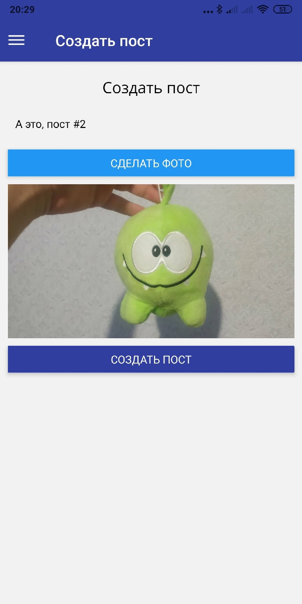

# todo-image-app

If you want to try out the application, then you can download it from the link*: https://disk.yandex.ru/d/QCcuq_1eGfUWGQ

*Unfortunately, you can only try the app on Android.

# Screenshoots:

